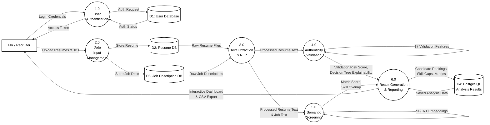

```mermaid
flowchart LR
    %% DATA FLOW DIAGRAM (LEVEL 1) - Monochrome

    %% External Entities
    ENT_HR["HR / Recruiter"]
    
    %% Databases
    DB_USER[("D1: User Database")]
    DB_RESUME[("D2: Resume DB")]
    DB_JOB[("D3: Job Description DB")]
    DB_RESULTS[("D4: PostgeSQL\nAnalysis Results")]
    
    %% Processes
    P1(("1.0\nUser\nAuthentication"))
    P2(("2.0\nData\nInput\nManagement"))
    P3(("3.0\nText Extraction\n& NLP"))
    P4(("4.0\nAuthenticity\nValidation"))
    P5(("5.0\nSemantic\nScreening"))
    P6(("6.0\nResult Generation\n& Reporting"))
    
    %% Data Flows
    ENT_HR -- "Login Credentials" --> P1
    P1 -- "Auth Request" --> DB_USER
    DB_USER -- "Auth Status" --> P1
    P1 -- "Access Token" --> ENT_HR
    
    ENT_HR -- "Upload Resumes & JDs" --> P2
    P2 -- "Store Resume" --> DB_RESUME
    P2 -- "Store Job Desc" --> DB_JOB
    
    DB_RESUME -- "Raw Resume Files" --> P3
    DB_JOB -- "Raw Job Descriptions" --> P3
    
    P3 -- "Processed Resume Text" --> P4
    P3 -- "Processed Resume Text\n& Job Text" --> P5
    
    P4 -- "17 Validation Features" --> P4
    P4 -- "Validation Risk Score,\nDecision Tree Explainability" --> P6
    
    P5 -- "SBERT Embeddings" --> P5
    P5 -- "Match Score,\nSkill Overlap" --> P6
    
    P6 -- "Candidate Rankings,\nSkill Gaps, Metrics" --> DB_RESULTS
    DB_RESULTS -- "Saved Analysis Data" --> P6
    
    P6 -- "Interactive Dashboard\n& CSV Export" --> ENT_HR

    %% Monochrome theme definitions
    classDef entity fill:#FFF,stroke:#000,stroke-width:1.5px,color:#000;
    classDef process fill:#FFF,stroke:#000,stroke-width:1.5px,color:#000;
    classDef database fill:#FFF,stroke:#000,stroke-width:1.5px,color:#000;
    
    class ENT_HR entity;
    class P1,P2,P3,P4,P5,P6 process;
    class DB_USER,DB_RESUME,DB_JOB,DB_RESULTS database;
```
