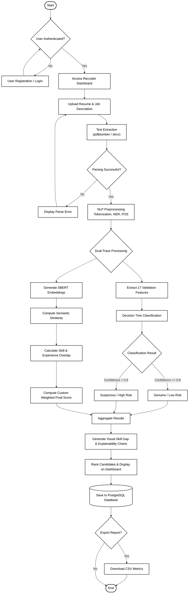

```mermaid
flowchart TD
    %% OPERATIONAL FLOWCHART - Monochrome

    START([Start]) --> LOGIN{User Authenticated?}
    
    LOGIN -- No --> AUTH_PROC[User Registration / Login]
    AUTH_PROC --> LOGIN
    
    LOGIN -- Yes --> DASH_ACCESS[Access Recruiter Dashboard]
    DASH_ACCESS --> UPLOAD[Upload Resume & Job Description]
    
    UPLOAD --> EXTRACT["Text Extraction\n(pdfplumber / docx)"]
    EXTRACT --> PARSE_CHECK{Parsing Successful?}
    
    PARSE_CHECK -- No --> ERR_MSG[Display Parse Error] --> UPLOAD
    PARSE_CHECK -- Yes --> NLP["NLP Preprocessing\nTokenization, NER, POS"]
    
    NLP --> PARALLEL_SPLIT{Dual-Track Processing}
    
    %% Track 1: Validation
    PARALLEL_SPLIT --> T1_FEAT[Extract 17 Validation Features]
    T1_FEAT --> T1_DT[Decision Tree Classification]
    T1_DT --> T1_RES{Classification Result}
    T1_RES -- Confidence >= 0.8 --> T1_GEN[Genuine / Low Risk]
    T1_RES -- Confidence < 0.8 --> T1_SUS[Suspicious / High Risk]
    
    %% Track 2: Screening
    PARALLEL_SPLIT --> T2_EMB[Generate SBERT Embeddings]
    T2_EMB --> T2_SIM[Compute Semantic Similarity]
    T2_SIM --> T2_SKILL[Calculate Skill & Experience Overlap]
    T2_SKILL --> T2_SCORE[Compute Custom Weighted Final Score]
    
    %% Merge
    T1_GEN --> MERGE[Aggregate Results]
    T1_SUS --> MERGE
    T2_SCORE --> MERGE
    
    MERGE --> VISUALIZE[Generate Visual Skill Gap & Explainability Charts]
    VISUALIZE --> RANK[Rank Candidates & Display on Dashboard]
    RANK --> DB_SAVE[(Save to PostgreSQL Database)]
    
    DB_SAVE --> EXPORT_CHECK{Export Report?}
    EXPORT_CHECK -- Yes --> CSV[Download CSV Metrics] --> END([End])
    EXPORT_CHECK -- No --> END

    %% Monochrome theme definitions
    classDef terminal fill:#FFF,color:#000,stroke:#000,stroke-width:2px,border-radius:15px;
    classDef process fill:#FFF,stroke:#000,stroke-width:1.5px,color:#000;
    classDef decision fill:#FFF,stroke:#000,stroke-width:1.5px,color:#000;
    classDef database fill:#FFF,stroke:#000,stroke-width:1.5px,color:#000;
    
    class START,END terminal;
    class UPLOAD,EXTRACT,NLP,T1_FEAT,T1_DT,T1_GEN,T1_SUS,T2_EMB,T2_SIM,T2_SKILL,T2_SCORE,MERGE,VISUALIZE,RANK,AUTH_PROC,DASH_ACCESS,ERR_MSG,CSV process;
    class LOGIN,PARSE_CHECK,PARALLEL_SPLIT,T1_RES,EXPORT_CHECK decision;
    class DB_SAVE database;
```
