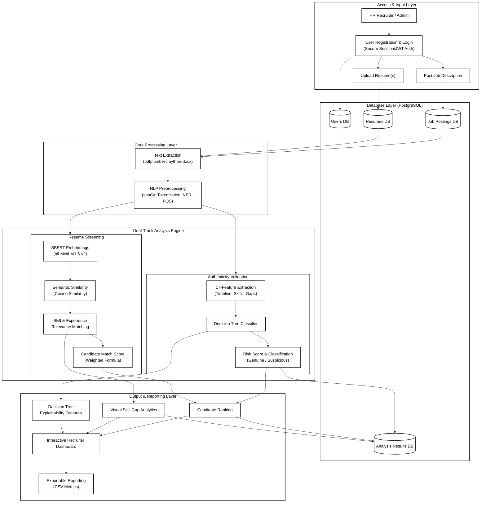

```mermaid
flowchart TD
    %% SYSTEM ARCHITECTURE DIAGRAM (Monochrome for A4 Print)

    subgraph USER_LAYER ["Access & Input Layer"]
        direction TB
        LOGIN["User Registration & Login\n(Secure Session/JWT Auth)"]
        HR["HR Recruiter / Admin"]
        HR --> LOGIN
        LOGIN --> POST_JOB["Post Job Description"]
        LOGIN --> UPLOAD_RESUME["Upload Resume(s)"]
    end

    subgraph DB_LAYER ["Database Layer (PostgreSQL)"]
        direction LR
        DB_USER[("Users DB")]
        DB_JOB[("Job Postings DB")]
        DB_RESUME[("Resumes DB")]
        DB_RESULTS[("Analysis Results DB")]
    end

    subgraph PROCESSING_LAYER ["Core Processing Layer"]
        direction TB
        TEXT_EXT["Text Extraction\n(pdfplumber / python-docx)"]
        NLP["NLP Preprocessing\n(spaCy: Tokenization, NER, POS)"]
        TEXT_EXT --> NLP
    end
    
    subgraph DUAL_TRACK ["Dual-Track Analysis Engine"]
        direction LR
        
        subgraph VALIDATION_TRACK ["Authenticity Validation"]
            direction TB
            FEAT_EXT["17-Feature Extraction\n(Timeline, Skills, Gaps)"]
            DT_CLASS["Decision Tree Classifier"]
            RISK_SCORE["Risk Score & Classification\n(Genuine / Suspicious)"]
            FEAT_EXT --> DT_CLASS --> RISK_SCORE
        end

        subgraph SCREENING_TRACK ["Resume Screening"]
            direction TB
            SBERT["SBERT Embeddings\n(all-MiniLM-L6-v2)"]
            SEM_SIM["Semantic Similarity\n(Cosine Similarity)"]
            SKILL_EXP["Skill & Experience\nRelevance Matching"]
            MATCH_SCORE["Candidate Match Score\n(Weighted Formula)"]
            SBERT --> SEM_SIM --> SKILL_EXP --> MATCH_SCORE
        end
    end

    subgraph OUTPUT_LAYER ["Output & Reporting Layer"]
        direction TB
        DASHBOARD["Interactive Recruiter Dashboard"]
        RANKING["Candidate Ranking"]
        SKILL_GAP["Visual Skill Gap Analytics"]
        EXPLAIN["Decision Tree\nExplainability Features"]
        EXPORT["Exportable Reporting\n(CSV Metrics)"]
        
        RANKING --> DASHBOARD
        SKILL_GAP --> DASHBOARD
        EXPLAIN --> DASHBOARD
        DASHBOARD --> EXPORT
    end

    %% Flow connections
    POST_JOB --> DB_JOB
    UPLOAD_RESUME --> DB_RESUME
    LOGIN -.-> DB_USER

    DB_JOB --> TEXT_EXT
    DB_RESUME --> TEXT_EXT

    NLP --> VALIDATION_TRACK
    NLP --> SCREENING_TRACK

    RISK_SCORE --> RANKING
    MATCH_SCORE --> RANKING
    SKILL_EXP --> SKILL_GAP
    DT_CLASS --> EXPLAIN
    
    RANKING --> DB_RESULTS
    SKILL_GAP --> DB_RESULTS
    RISK_SCORE --> DB_RESULTS
    
    %% Monochrome theme definitions
    classDef plain fill:#FFF,stroke:#000,stroke-width:1.5px,color:#000;
    
    class USER_LAYER,LOGIN,HR,POST_JOB,UPLOAD_RESUME plain;
    class DB_LAYER,DB_USER,DB_JOB,DB_RESUME,DB_RESULTS plain;
    class PROCESSING_LAYER,TEXT_EXT,NLP plain;
    class DUAL_TRACK,VALIDATION_TRACK,SCREENING_TRACK,FEAT_EXT,DT_CLASS,RISK_SCORE,SBERT,SEM_SIM,SKILL_EXP,MATCH_SCORE plain;
    class OUTPUT_LAYER,DASHBOARD,RANKING,SKILL_GAP,EXPLAIN,EXPORT plain;
```
